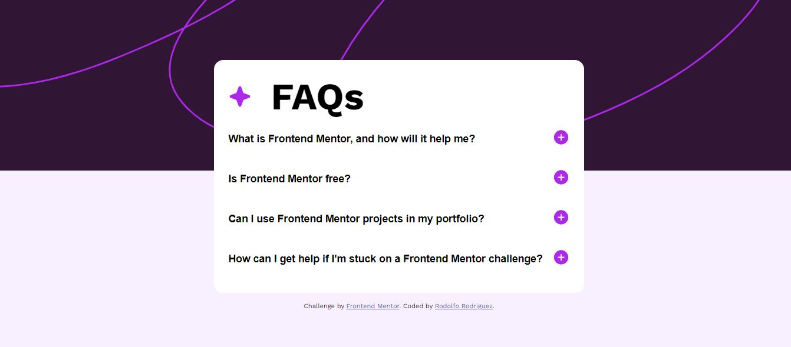
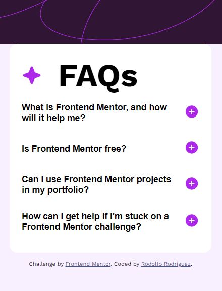

# Frontend Mentor - FAQ accordion solution


This is a solution to the [FAQ accordion challenge on Frontend Mentor](https://www.frontendmentor.io/challenges/faq-accordion-wyfFdeBwBz). Frontend Mentor challenges help you improve your coding skills by building realistic projects. 

## Overview

- making an accordion including JavaScript
### The challenge

 - You must have control of the HTML, CSS and JavaScript codes for the accordion to work, this is the challenge

Users should be able to:

- Hide/Show the answer to a question when the question is clicked
- Navigate the questions and hide/show answers using keyboard navigation alone
- View the optimal layout for the interface depending on their device's screen size
- See hover and focus states for all interactive elements on the page

### Screenshot





### Links

- Solution URL: [Add solution URL here](https://github.com/rodjoker/faq-accordion-main?tab=readme-ov-file)
- Live Site URL: [Add live site URL here](https://faq-accordion-main-ochre.vercel.app/)

## My process

- I develop my skills every day to be a better programmer, I want to have experience when my first job opportunity presents itself

### Built with

- Semantic HTML5 
- CSS 
- Flexbox


### What I learned

making the content appear and disappear was very difficult, also changing the button from "+" to "-" and vice versa, I learned how to add and remove classes with JavaScript


simple structure for an accordion:

```html
<div class="accordionItem">

        <button id="accordionBtn3" class="accordionBtn">          
              here goes the question
          <div class="icons">
            here goes symbol "+" and "-"
          </div>
        </button>
           
        <div class="accordion-description">
            <p class="content">             
            here goes the content
            </p>
        </div>
```
```css
.accordion-description {
    background-color: var(--White);
    max-height: 1000px;
    overflow: hidden;
    transition: max-height 200ms ease;
    display: none; 
}
```
```js
 accordionBtns.forEach(function (btn) {
                if (btn === button) {
                    btn.classList.toggle('active');
                } else {
                    btn.classList.remove('active');
                }
            });
```

### Continued development

I will continue learning and practicing JavaScript code, since I still do not feel comfortable doing this type of projects.

### Useful resources

- [Example resource 1](https://lenguajecss.com/css/introduccion/navegadores-web/) - 
This is a very good page to learn CSS, one hundred percent recommended.
- [Example resource 2](https://www.youtube.com/@EduardoFierroPro) - He teaches everything about what a web page, accordion, carousel, etc. can contain..


## Author

- Frontend Mentor - [@rodjoker](https://www.frontendmentor.io/profile/rodjoker)
- [Author](Rodolfo Rodriguez (RodCode))

## Acknowledgments

I want to thank FrontendMentor for these challenges, they are a good way to gain experience, it is what a developer needs most after finishing their training.

